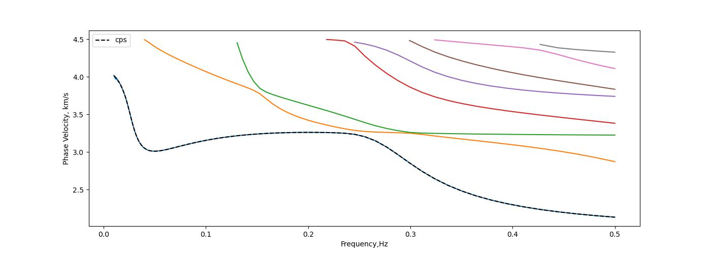
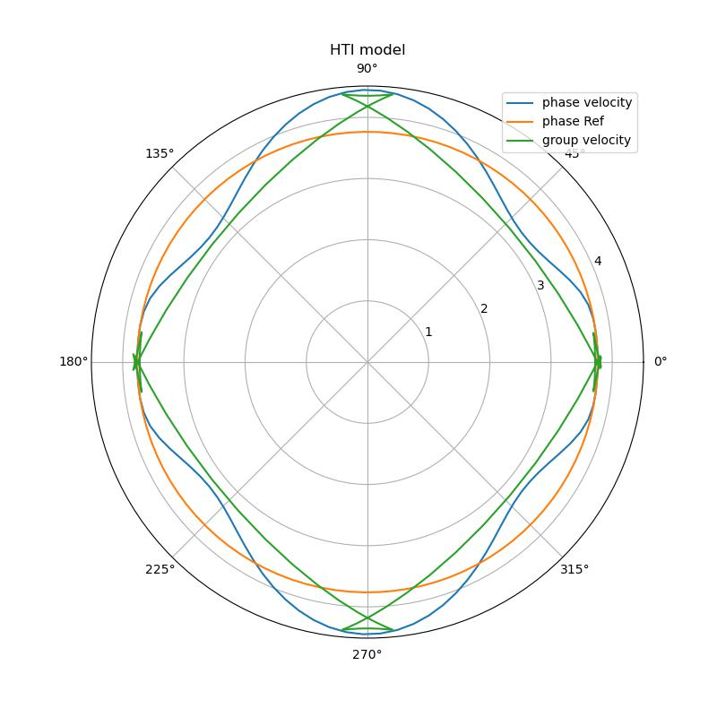

# SWDTTI
**SWDTTI** utilizes spectral element method and quadratic eigenvalue solver to compute surface wave dispersion, eigen function and sensitivity kernels for **general layered TI** model (Tilted Transversely Isotropic).

It can handle dispersion values for any TI-type layered model, any frequency, and any mode.

## Requirements and Installation
1. **Compilers:** C++/Fortran compilers which support c++14 (tested on `GCC >=7.5`), `cmake >= 3.12`

2. packages:
* [Eigen](https://eigen.tuxfamily.org/index.php?title=Main_Page) >= 3.4.0
* [MKL/LAPACK](https://www.netlib.org/lapack/lapacke.html), optional.
* [doxygen](https://www.doxygen.nl/) for api document generation, optional.

3. Install:
```bash
mkdir -p build; cd build;
cmake .. -DCXX=g++ -DFC=gfortran  -DEIGEN_INC=/path/to/eigen/ -DUSE_LAPACK=FALSE
make -j4; make install 
```
If you want to use `LAPACKE/MKL`, you can set `-DUSE_LAPACK=TRUE`. This program also provides python libraries (`.so`) and you can install them by adding ```-DUSE_PYLIB=TRUE -DPYTHON_EXECUTABLE=`which python` ```

4. install API docs
```bash
cd doxygen
doxygen config.cfg
```

# Gallery
### Benchmark: SWDTTI with CPS330

### HTI model: Phase velocity vs. Azimuthal angle


